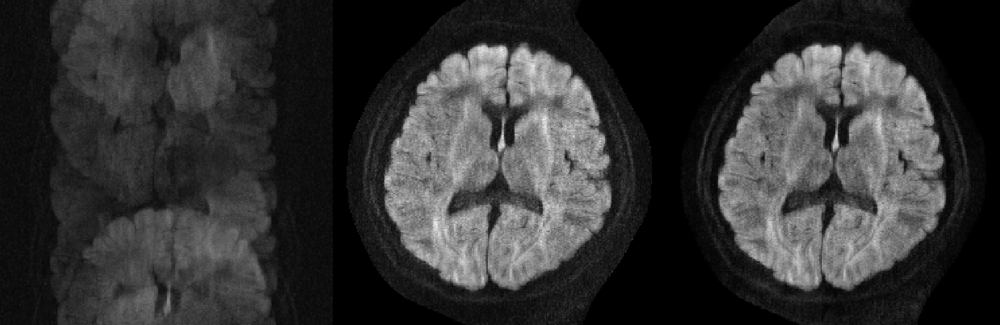

# Shot-LLR (shot locally low-rank)
Multi-shot diffusion-weighted MRI reconstruction using locally low-rank regularization. 

### Introduction
Shot-LLR is a reconstruction method for multi-shot diffusion-weighted MRI without explicit phase estimation. A convex model with a locally low-rank constraint on the spatial-shot matrices is proposed to resolve phase variations between different shots. For more detailed explanations, please refer to [our paper published on MRM](https://onlinelibrary.wiley.com/doi/full/10.1002/mrm.27488).

### Usage
There are two folders, and each has an implementation based on different lanuages or tools:

(1) sllr_bart: based on [BART](https://mrirecon.github.io/bart/), which needs to be installed and added to path (!) before you run this script. 

(2) sllr_matlab: purely in Matlab.

The implementaion of shot-LLR in Matlab is based on [Dr. Tao Zhang's work](http://mrsrl.stanford.edu/~tao/software.html), and the problem is solved using [POCS algorithm](https://en.wikipedia.org/wiki/Projections_onto_convex_sets). 

One nice thing of using BART is that it runs fast and easy to call (once it compiles for you and you know how it works). In BART, this reconstruction problem is solved using [FISTA](https://people.rennes.inria.fr/Cedric.Herzet/Cedric.Herzet/Sparse_Seminar/Entrees/2012/11/12_A_Fast_Iterative_Shrinkage-Thresholding_Algorithmfor_Linear_Inverse_Problems_(A._Beck,_M._Teboulle)_files/Breck_2009.pdf) by default. 

The other difference between these two versions is that in BART the regularization parameter is scaled based on the matrix size, which means different regularization parameters should be used between these two versions. I would recommend using BART or other reconstruction tools once everything is settled down.

### Results
One four-shot brain DWI data and corresponding sensitivity map are provieded (matrix size: 168-168, 48 coils). You should be able get the following results (after some rotation and shift). 

  
  
Example output (left: just Fourier transform without phase correction, middle: shot-LLR based on BART, right: shot-LLR using POCS).

The difference between middle and right should mainly come from the regularization parameter difference (they both work well). Here no Partial Fourie reconstruction is used so the results look a little blurry, feel free to try [Homodyne](https://users.fmrib.ox.ac.uk/~karla/reading_group/lecture_notes/Recon_Pauly_read.pdf) or our [virtual conjugate shot method](https://onlinelibrary.wiley.com/doi/full/10.1002/mrm.27488).

